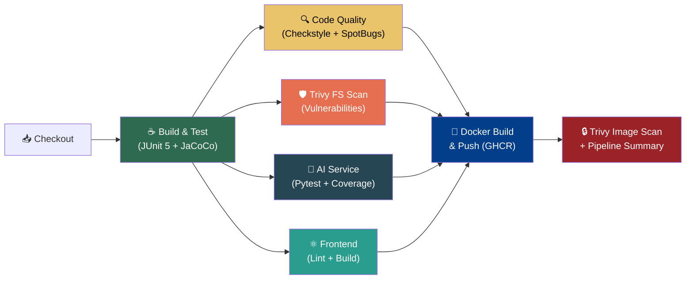
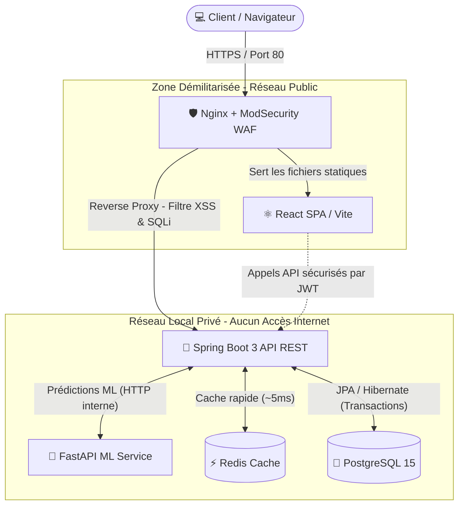

<div align="center">
  <h1>🚗 Driving School Management System (ERP & CRM)</h1>
  <p><em>Plateforme complète de gestion pour Auto-École : CRM, Planification, Finances, Ressources Humaines et Intelligence Artificielle.</em></p>
  
  [](https://github.com/AymanTN1/drivingSchool/actions/workflows/main-ci.yml)
  [](https://github.com/AymanTN1/drivingSchool/actions/workflows/codeql-analysis.yml)
  [](#)
  [](https://spring.io/projects/spring-boot)
  [](https://reactjs.org/)
  [](#)
  [](#)
  [](#)
  [](#)
  [](#)
  [](#)
  [](#)
</div>

<br/>

## 🎯 Contexte du Projet

La gestion d'une auto-école moderne va bien au-delà de la simple réservation de leçons de conduite. Elle implique une logistique complexe : suivi des paiements fragmentés, maintenance de la flotte automobile, quotas d'examens (NARSA) et gestion de la paie des moniteurs.

J'ai développé ce projet full-stack pour répondre à ces problématiques concrètes en centralisant toutes les opérations sur une plateforme unique, rapide et hautement sécurisée — **enrichie par une couche d'Intelligence Artificielle** pour la maintenance prédictive et l'analyse comportementale des candidats.

---

## 🏗️ Pipeline CI/CD (DevSecOps)

Le projet utilise un pipeline d'intégration et déploiement continu de **niveau entreprise**, composé de **7 étapes** orchestrées avec dépendances :



| Étape | Outil | Objectif |
|---|---|---|
| **Build & Test** | JUnit 5, JaCoCo (seuil ≥ 40%) | Tests unitaires + couverture de code |
| **Code Quality** | Checkstyle, SpotBugs | Analyse statique (équivalent SonarQube) |
| **Security Scan** | Trivy (Filesystem) | Détection de CVEs dans le code source |
| **AI Service** | Pytest, pytest-cov | Tests + couverture du microservice Python |
| **Frontend** | Node.js, npm build | Vérification de la compilation React |
| **Docker Push** | GHCR (GitHub Packages) | Publication des images Docker |
| **Image Scan** | Trivy (Docker Image) | Détection de CVEs dans les images |

**Outils de sécurité additionnels :**
- 🔐 **GitHub CodeQL** — Analyse SAST (SQL Injection, XSS, etc.) sur Java, JavaScript et Python.
- 🤖 **Dependabot** — Mise à jour automatique des dépendances vulnérables (Maven, NPM, Pip).

---

## 🗺️ Architecture Système & Réseau

L'application est conçue selon une architecture **Microservices DevSecOps**, divisant l'infrastructure en zones de sécurité (DMZ / LAN) avec un filtrage actif.



---

## 🧠 Intelligence Artificielle & Data Science

### 📊 Maintenance Prédictive de la Flotte
Un microservice **FastAPI (Python)** analyse l'historique d'utilisation des véhicules (kilométrage, fréquence de conduite) pour générer un **Score de Risque** (0% à 100%) pour chaque composant :
- 🔧 Vidange moteur · 🛞 Pneus · 🔴 Plaquettes de frein · 💨 Essuie-glaces · ⚙️ Révision moteur

### 🧠 Détection de Risque d'Abandon (Analyse Comportementale)
L'IA analyse le parcours de chaque candidat (score au code, taux d'absentéisme, évaluation du moniteur) et génère une **Alerte Rouge** lorsqu'un candidat risque d'échouer ou d'abandonner, permettant d'agir de manière proactive.

---

## 💡 Fonctionnalités Principales

* 💰 **Gestion Financière (Caisse)** : Suivi des versements des candidats, calcul automatique des reliquats et blocage intelligent des réservations d'examen en cas de solde débiteur.
* 🚗 **Logistique & Flotte** : Suivi des entretiens périodiques (Visites techniques, Vidanges), gestion de la consommation de carburant et calcul de rentabilité par véhicule. Détection des pics anormaux de consommation (Alerte > 50%).
* 👥 **Ressources Humaines** : Génération automatique des fiches de paie pour les moniteurs en fonction des heures de conduite réellement effectuées, avec primes et déductions dynamiques.
* 📅 **Planning Interactif & Moteur de Règles** : Planification des leçons avec gestion anti-conflits (véhicules ou moniteurs double-bookés) et respect des plafonds horaires hebdomadaires.
* 📈 **CRM & Pipeline de Vente** : Tunnel de conversion complet (Landing Page ➔ Appel ➔ Attente Dossier ➔ Inscrit) pour optimiser l'acquisition de nouveaux élèves.
* 📊 **Dashboard Analytique** : KPIs en temps réel, évolution mensuelle du chiffre d'affaires, et alertes préventives.

---

## 🛠️ Stack Technique

### Backend (Core API)
- **Java 21** & **Spring Boot 3.2.5** (RESTful API)
- **Spring Security** avec authentification **JWT** (RBAC : Admin, Assistant, Moniteur, Candidat)
- **Spring Data JPA / Hibernate**
- **Jakarta Validation** (Validation stricte des DTOs)
- **Swagger / OpenAPI 3** (Documentation interactive)

### AI & Data Science (Microservice)
- **Python 3.11** & **FastAPI** (API de prédiction)
- Algorithmes de scoring prédictif (Maintenance & Comportement)
- Architecture microservices isolée (communication HTTP interne)

### Frontend (UI/UX)
- **React.js** (Vite)
- Composants interactifs (Calendriers, Jauges de risque IA, Tableaux de bord dynamiques)

### Base de données & Infrastructure
- **PostgreSQL 15** (Données relationnelles structurées)
- **Redis 7** (Mise en cache pour soulager la base de données)
- **Docker & Docker Compose** (Déploiement multi-services)

### DevSecOps & CI/CD
- **GitHub Actions** (Pipeline 7 étapes)
- **Trivy** (Scan de vulnérabilités : filesystem + images Docker)
- **Checkstyle + SpotBugs** (Analyse statique de code)
- **JaCoCo** (Couverture de code avec seuil minimum)
- **CodeQL** (SAST — détection SQL Injection, XSS)
- **Dependabot** (Surveillance automatique des dépendances)
- **GHCR** (GitHub Container Registry — stockage des images Docker)

---

## 🧪 Qualité du Code & Tests

Le projet est couvert par une suite de **tests d'intégration et unitaires** (JUnit 5, MockMvc, Pytest, H2 in-memory DB) garantissant la fiabilité des processus critiques :
- Moteur de conflit de réservation (Heures chevauchées, véhicule indisponible).
- Calculs financiers et algorithmes de paie.
- Sécurité RBAC et protection des endpoints.
- Modèles d'IA (Prédiction de maintenance & scoring de risque candidat).

**Le pipeline CI/CD s'assure automatiquement que :**
- ✅ 100% des tests passent avant toute intégration.
- ✅ La couverture de code reste au-dessus du seuil minimum (40%).
- ✅ Aucune vulnérabilité critique n'est introduite dans le code ou les images Docker.

---

## 🚀 Guide de Démarrage (Local)

Prérequis : `Docker` et `docker-compose` installés sur votre machine.

**1. Cloner le dépôt**
```bash
git clone https://github.com/AymanTN1/drivingSchool.git
cd drivingSchool
```

**2. Lancer l'infrastructure complète**
L'environnement Docker s'occupe de tout : Base de données, Redis, Backend, AI Service et Frontend.
```bash
docker-compose up --build -d
```

**3. Accéder à l'application**
- **Application Web** : `http://localhost:8080`
- **Documentation API (Swagger)** : `http://localhost:8080/swagger-ui/index.html`
- **AI Service Health** : `http://localhost:8000/health`

*(Les services intègrent des `healthchecks` pour garantir que le Backend ne démarre que lorsque PostgreSQL et Redis sont prêts).*

---
<div align="center">
  <i>Développé avec passion pour digitaliser et optimiser l'apprentissage de la conduite automobile au Maroc.</i>
</div>
